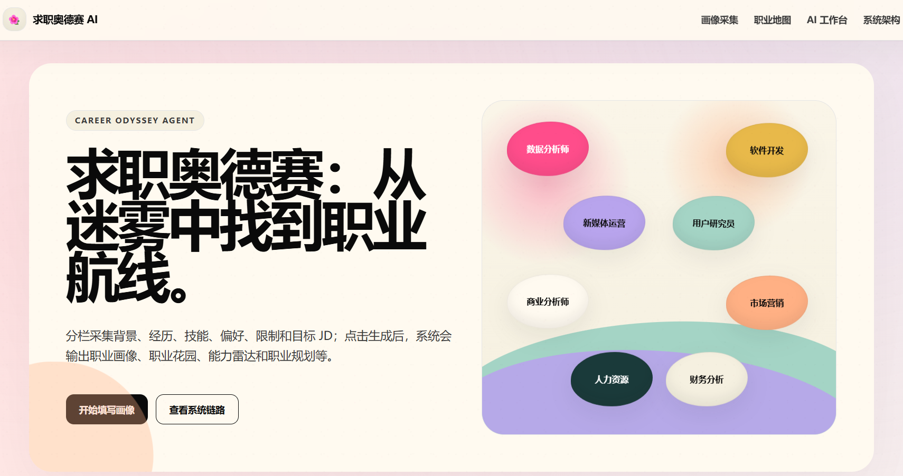
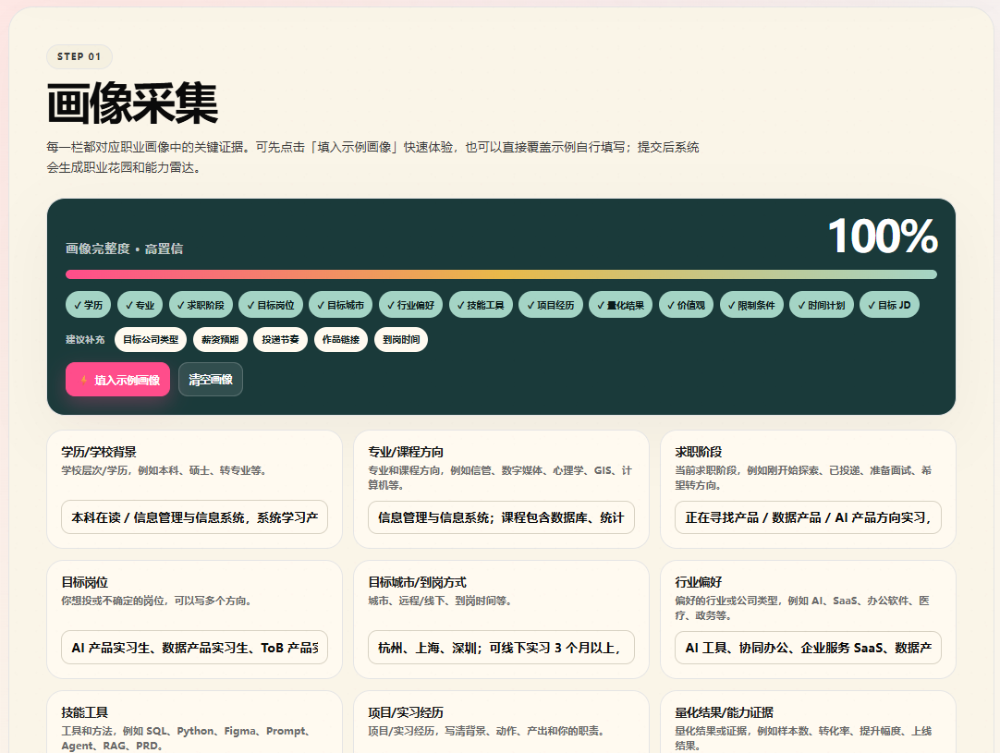
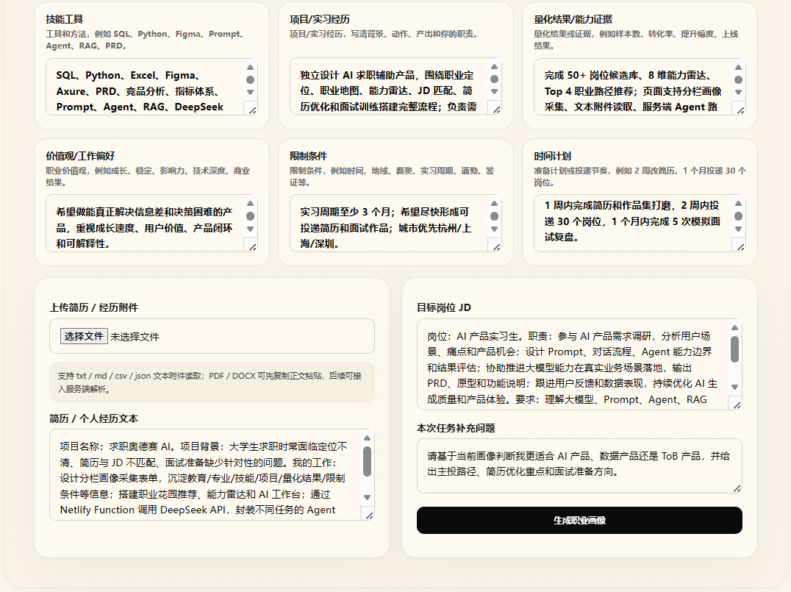
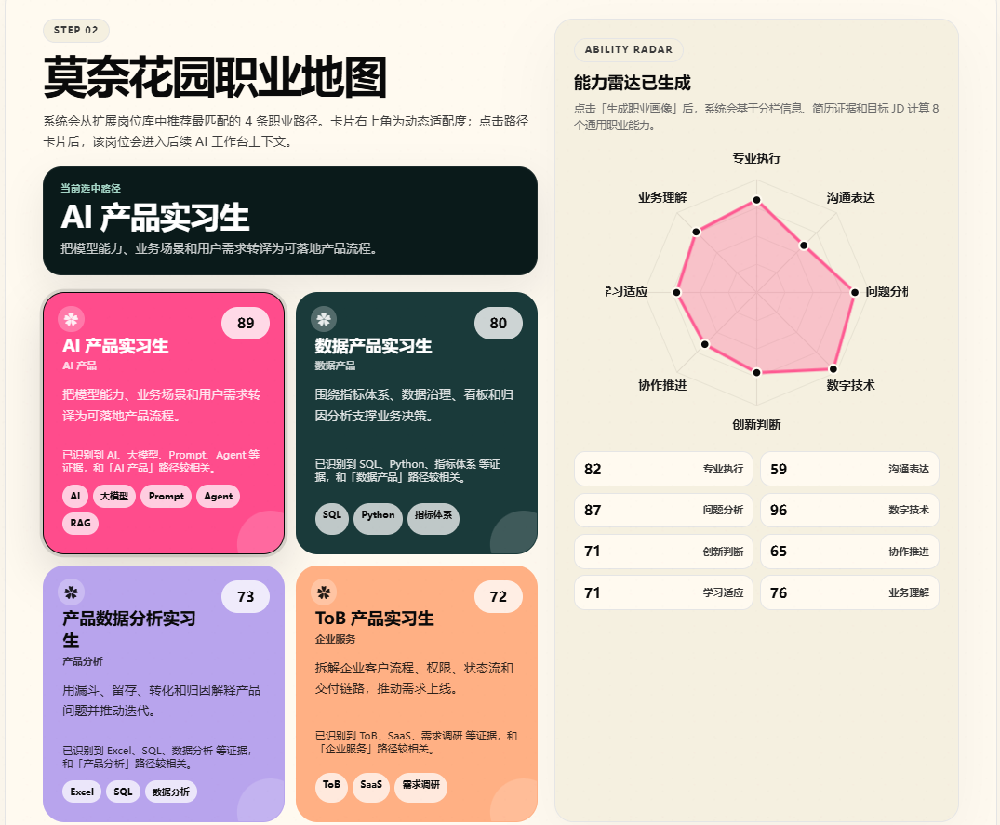
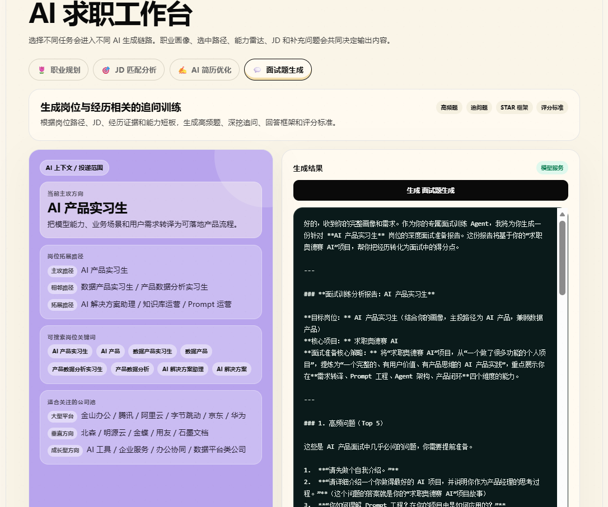
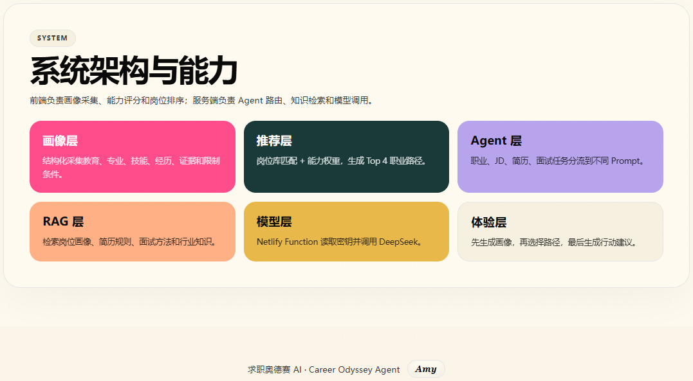

# Career Odyssey Agent｜求职奥德赛 AI

一个面向求职者的 AI 职业规划系统。项目通过结构化画像采集、职业路径推荐、能力雷达、AI 求职工作台与 Agent / RAG 知识增强，将零散的背景、经历、技能、偏好、限制条件和目标 JD 转化为可执行的求职方案。

[在线体验](https://job-odyssey-ai.netlify.app)


---

## 项目定位

求职者在投递前经常面临三个问题：不知道自己适合什么岗位，不知道如何把经历改写成岗位语言，也不知道如何把简历、项目和面试准备串成一套闭环。

Career Odyssey Agent 将求职流程拆成四步：

1. **采集画像**：分栏收集学历、专业、技能、项目、结果、偏好、限制条件和目标 JD。
2. **生成路径**：基于画像匹配职业路径，输出职业花园和能力雷达。
3. **进入工作台**：用户选择目标路径后，系统将该路径写入 AI 上下文。
4. **产出执行方案**：围绕职业规划、JD 匹配、简历优化和面试训练生成可执行建议。

---

## Product Preview

### 1. 首页与职业入口

首页使用 Career Odyssey 的隐喻表达“从迷雾中找到职业航线”，通过 8 个固定分布的热门岗位气泡展示多方向职业入口。



### 2. 结构化画像采集

画像采集区将求职信息拆成多个字段，并提供“填入示例画像”能力，方便用户快速体验完整流程。





### 3. 莫奈花园职业地图与能力雷达

系统会根据用户输入生成 Top 4 推荐路径，并以能力雷达展示通用职业能力评分，包括专业执行、沟通表达、问题分析、数字技术、创新判断、协作推进、学习适应和业务理解。



### 4. AI 求职工作台

用户选择职业路径后，AI 工作台会围绕该路径生成职业规划、JD 匹配、简历优化和面试训练内容。左侧负责展示 AI 上下文与投递范围，右侧负责输出更深入的求职执行方案。



### 5. 系统架构与能力

系统采用前端画像采集、推荐层路径匹配、Agent 路由、RAG 知识检索和模型调用的分层设计。



---

## 核心功能

### 结构化职业画像

系统不依赖单一输入框，而是将求职画像拆分为学历背景、专业方向、求职阶段、目标岗位、城市偏好、行业偏好、技能工具、项目经历、量化结果、价值观、限制条件、时间计划、简历文本和目标 JD 等字段。

这种设计可以减少用户输入的混乱度，也方便后续模型更准确地理解用户当前状态。

### 职业花园推荐

职业路径以花园卡片形式呈现。每张卡片包含岗位名称、匹配分数、推荐理由和关键标签。用户点击某条路径后，该岗位会成为后续 AI 工作台的主上下文。

### 通用能力雷达

能力雷达不只服务某一类岗位，而是面向多专业、多方向求职者设计。8 个维度分别是：

- 专业执行
- 沟通表达
- 问题分析
- 数字技术
- 创新判断
- 协作推进
- 学习适应
- 业务理解

分数会根据用户输入的技能、经历、JD 和任务补充信息动态计算。

### AI 求职工作台

工作台提供四类任务：

- **职业规划**：生成求职执行方案，重点覆盖简历、项目、作品集、面试和行动计划。
- **JD 匹配分析**：拆解目标岗位要求，识别已有证据和缺口。
- **AI 简历优化**：围绕当前路径改写简历表达，输出可复用 bullet。
- **面试题生成**：生成高频问题、追问问题、STAR 回答框架和评分标准。

---

## AI 设计

### Agent Router

不同任务会进入不同的 Agent Prompt：职业规划、JD 匹配、简历优化和面试训练分别使用不同的生成链路，避免所有问题都被同一种提示词处理。

### Lightweight RAG

项目内置轻量级岗位知识库，覆盖产品、数据、技术、运营、市场、研究、商业、咨询、金融、教育、医疗、设计等方向。系统会根据当前画像、选中路径和任务类型检索相关知识，并注入模型上下文。

### Model Service

后端通过 Netlify Function 调用 DeepSeek API。前端不直接暴露模型密钥，API Key 通过 Netlify 环境变量管理。

---

## 求职执行方案输出结构

为减少空泛建议，职业规划模块采用更偏执行的输出结构：

1. **求职诊断摘要**：判断当前画像最需要解决的问题。
2. **简历重构方案**：给出求职意向、技能栏、项目经历、经历 bullet 和改写对比。
3. **经历挖掘与项目补强**：指出可挖掘经历和建议补强项目。
4. **作品集 / 项目案例包装**：指导如何将项目整理成可展示案例。
5. **面试准备方案**：生成高频问题、追问方向和回答框架。
6. **投递执行与反馈优化**：给出投递节奏和反馈复盘方法。
7. **7 / 14 / 30 天交付清单**：将建议转化为具体产出物。

---

## 技术栈

| 模块 | 技术 |
|---|---|
| 前端 | React, TypeScript, Vite |
| 样式 | CSS, Responsive Layout, Custom Visual Components |
| 后端 | Netlify Functions |
| 模型调用 | DeepSeek API |
| AI 编排 | Agent Router, Prompt Routing |
| 知识增强 | Lightweight RAG Knowledge Base |
| 部署 | GitHub + Netlify |

---

## 项目结构

```text
.
├── src/
│   ├── main.tsx          # 页面逻辑、画像采集、职业推荐、AI 工作台
│   └── style.css         # 页面样式、响应式布局、职业花园视觉
├── netlify/
│   └── functions/
│       └── ai.js         # Netlify Function，负责 Agent / RAG / 模型调用
├── api/
│   └── ai.js             # API 兼容入口
├── docs/                 # 静态部署备用目录
├── dist/                 # 构建产物
├── assets/               # README 展示截图
├── index.html
├── package.json
├── package-lock.json
├── netlify.toml
├── vite.config.ts
└── README.md
```

---

## 本地运行

```bash
npm install
npm run dev
```

本地构建：

```bash
npm run build
```

---

## Netlify 部署

项目已适配 Netlify 部署。部署时需要在 Netlify 后台配置环境变量：

```text
DEEPSEEK_API_KEY=你的 DeepSeek API Key
```

推荐部署配置：

```text
Build command: npm run build
Publish directory: dist
Functions directory: netlify/functions
```

`.npmrc` 已设置为公开 npm registry，避免构建时出现私有 registry 依赖源问题。

---

## 后续优化方向

- 接入真实岗位数据源，扩展岗位库规模和更新频率。
- 将轻量 RAG 升级为向量检索，支持更细粒度的岗位知识匹配。
- 增加 PDF / DOCX 简历解析能力，减少用户复制粘贴成本。
- 增加投递记录和反馈复盘模块，形成更完整的求职闭环。
- 为不同专业用户提供更细的能力模型和路径解释。

---

## Author

**Amy**

Career Odyssey Agent 将复杂求职信息转化为更清晰的路径、材料和行动方案。
